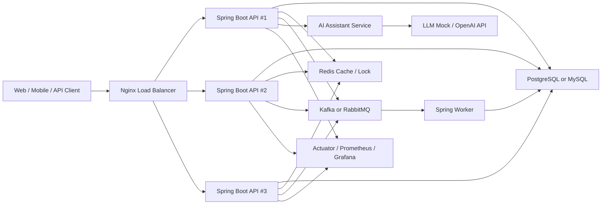

# 아키텍처

## 설계 방향

초기 버전은 모듈러 모놀리스로 시작합니다. 하나의 Spring Boot 애플리케이션 안에서 도메인 경계를 명확히 나누고, 이후 필요한 부분만 Worker, AI Service, Batch Service로 분리합니다.

이 방식은 포트폴리오 완성도를 유지하면서도 MSA, 이벤트 기반 처리, 서버 분리, 로드밸런싱을 단계적으로 보여주기 좋습니다.

## 전체 구조



## 애플리케이션 모듈

```text
com.petopscommerce
  global
    config
    security
    exception
    response
    audit
  domain
    member
    pet
    product
    cart
    order
    payment
    coupon
    warehouse
    stock
    notification
  batch
    sales
    stock
  infra
    redis
    mq
    ai
    monitoring
```

## 계층 구조

```text
Controller
  -> Application Service
    -> Domain Service / Entity
      -> Repository
        -> Database
```

## 도메인 분리 원칙

- `order`는 주문 생성과 상태 변경을 담당한다.
- `stock`은 재고 수량과 재고 이력을 담당한다.
- `payment`는 결제 승인/실패 상태만 다룬다.
- `coupon`은 할인 정책과 사용 이력을 담당한다.
- `notification`은 이벤트 기반 알림으로 확장한다.

## 서버 확장 전략

- API 서버는 여러 개 실행 가능해야 한다.
- API 서버 로컬 메모리에 사용자 세션을 저장하지 않는다.
- JWT로 인증하고 Redis는 캐시/락/토큰 블랙리스트에 사용한다.
- Nginx는 Round Robin 방식으로 API 요청을 분산한다.
- 재고 차감은 DB 락 또는 Redis 분산락으로 동시성 문제를 방지한다.

