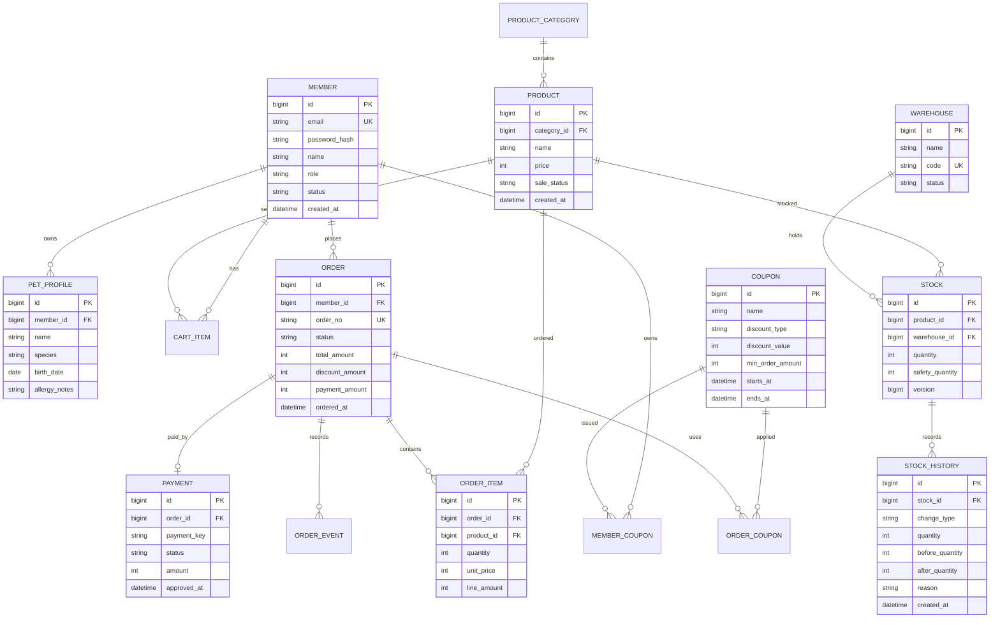

# ERD 초안

## 핵심 엔티티

## 초기 인덱스 후보

| 테이블 | 인덱스 | 목적 |
|---|---|---|
| member | email | 로그인 |
| product | category_id, sale_status | 상품 목록 필터 |
| stock | product_id, warehouse_id | 상품/창고별 재고 조회 |
| stock_history | stock_id, created_at | 재고 이력 조회 |
| orders | member_id, ordered_at | 회원 주문 내역 |
| orders | order_no | 주문 단건 조회 |
| order_event | order_id, created_at | 주문 이벤트 추적 |

## 동시성 검토 대상

- 주문 생성 시 재고 차감
- 주문 취소 시 재고 복구
- 쿠폰 중복 사용 방지
- 결제 승인 이벤트 중복 수신 방지

