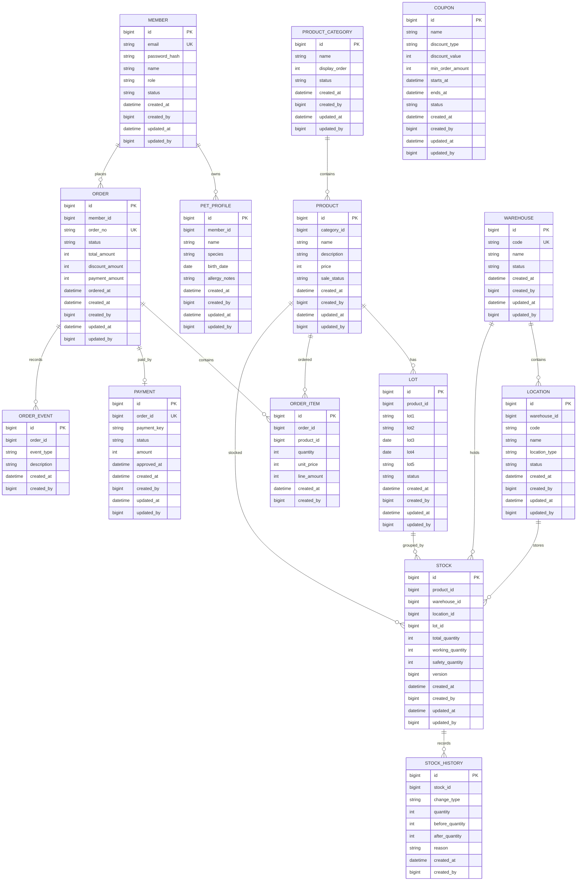

# ERD 초안

## 설계 기준

- DB 레벨 FK 제약은 걸지 않습니다.
- `*_id` 컬럼과 인덱스로 논리 관계를 표현합니다.
- 관계 검증은 서비스 로직과 테스트에서 처리합니다.
- 주요 테이블에는 `created_at`, `created_by`, `updated_at`, `updated_by`를 둡니다.
- LOT 정보는 `lot1` ~ `lot5`로 관리하고, 상세 의미는 문서와 comment로 설명합니다.
- 재고는 `창고 -> location -> 상품/LOT 현재고` 순서로 관리합니다.
- 재고 가용수량은 `total_quantity - working_quantity`로 계산합니다.

## 상품 소유 모델

현재 ERD는 단일 운영사 B2C 커머스를 기준으로 합니다.

- 상품은 운영사가 등록하고 관리합니다.
- 회원은 상품을 판매하지 않고 구매합니다.
- `products.category_id`는 상품 분류를 위한 논리 관계입니다.
- `products`에는 `seller_id`, `vendor_id`, `company_id`를 두지 않습니다.

입점 판매자형 마켓플레이스로 확장할 경우에는 `vendors` 또는 `stores` 테이블을 추가하고 `products.vendor_id` 같은 소유 주체 컬럼을 별도 설계합니다.

## 핵심 엔티티



## LOT 컬럼 의미

| 컬럼 | 의미 |
|---|---|
| lot1 | LOT 주요 식별값 |
| lot2 | 보조 LOT 정보 |
| lot3 | 유효기간 |
| lot4 | 입고일자 |
| lot5 | 기타 관리값 |

## 초기 인덱스 후보

| 테이블 | 인덱스 | 목적 |
|---|---|---|
| members | email | 로그인 |
| pet_profiles | member_id | 회원별 반려동물 조회 |
| products | category_id, sale_status | 상품 목록 필터 |
| lots | product_id | 상품별 LOT 조회 |
| lots | lot3 | 유효기간 기준 조회 |
| lots | lot4 | 입고일자 기준 조회 |
| locations | warehouse_id | 창고별 location 조회 |
| stocks | product_id, warehouse_id, location_id, lot_id | 상품/창고/location/LOT별 재고 조회 |
| stock_histories | stock_id, created_at | 재고 이력 조회 |
| orders | member_id, ordered_at | 회원 주문 내역 |
| orders | order_no | 주문 단건 조회 |
| order_items | order_id | 주문별 상품 조회 |
| order_events | order_id, created_at | 주문 이벤트 추적 |

## 동시성 검토 대상

- 주문 생성 시 재고 차감
- 주문 취소 시 재고 복구
- LOT별 재고 차감 순서
- 쿠폰 중복 사용 방지
- 결제 승인 이벤트 중복 수신 방지
```

## 재고 작업 흐름

재고 수량은 아래 세 값을 기준으로 해석합니다.

| 항목 | 의미 |
|---|---|
| total_quantity | 해당 location에 실제 존재하는 총수량 |
| working_quantity | 할당/피킹/출고 작업 중이라 판매 가능하지 않은 수량 |
| available_quantity | `total_quantity - working_quantity`로 계산하는 가용수량 |

할당, PICK, 출고 흐름은 아래 기준으로 설계합니다.

```text
할당
- NOMAL location에서 주문에 사용할 재고를 찜
- total_quantity 유지
- working_quantity 증가
- available_quantity 감소

PICK
- NOMAL location에서 PICKTO location으로 재고 이동
- NOMAL location: total_quantity 감소, working_quantity 감소
- PICKTO location: total_quantity 증가, working_quantity 증가
- 창고 전체 총수량은 유지

출고
- PICKTO location에서 실제 출고
- PICKTO location: total_quantity 감소, working_quantity 감소
- 창고 전체 총수량 감소
```