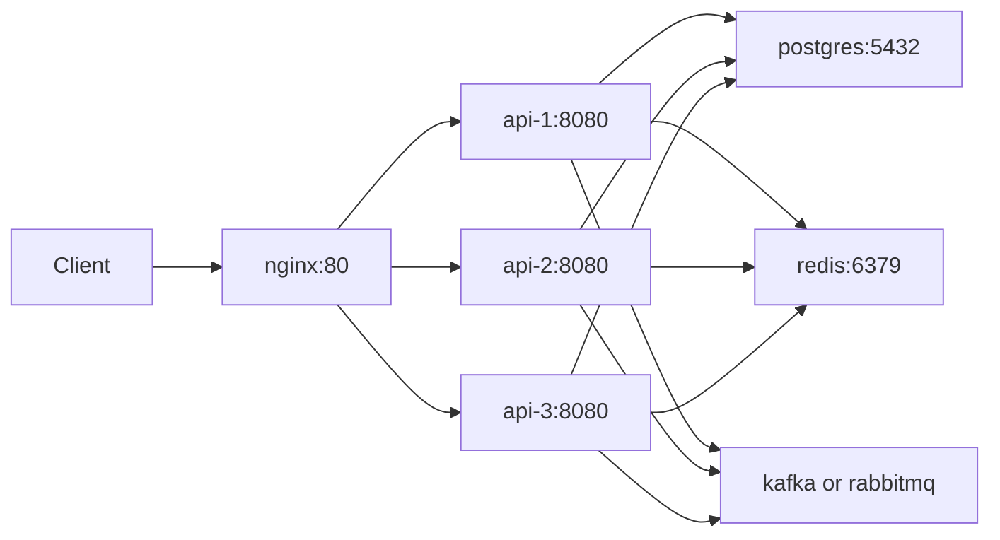

# 인프라와 로드밸런싱

## 목표

로컬 Docker Compose 환경에서 실제 운영과 비슷하게 서버를 분리합니다.

- Nginx 1대
- Spring Boot API 서버 3대
- PostgreSQL DB 1대
- Redis 1대
- Message Queue 1대
- Monitoring Stack

## 구성 예시



## Nginx upstream 전략

초기에는 Round Robin을 사용합니다.

```nginx
upstream petops_api {
    server api-1:8080;
    server api-2:8080;
    server api-3:8080;
}

server {
    listen 80;

    location / {
        proxy_pass http://petops_api;
        proxy_set_header Host $host;
        proxy_set_header X-Real-IP $remote_addr;
        proxy_set_header X-Forwarded-For $proxy_add_x_forwarded_for;
    }
}
```

## API 서버 stateless 원칙

- 서버 메모리에 로그인 세션을 저장하지 않는다.
- 인증은 JWT를 사용한다.
- 캐시와 분산락은 Redis를 사용한다.
- 파일 업로드가 필요하면 로컬 디스크가 아니라 Object Storage 후보를 둔다.
- 동일 요청이 어느 API 서버로 가도 같은 결과가 나와야 한다.

## 포트폴리오 설명 포인트

면접에서는 아래처럼 설명할 수 있게 구현합니다.

> Docker Compose에서 동일한 Spring Boot API 컨테이너를 여러 개 실행하고, Nginx upstream으로 요청을 분산했습니다. 서버 확장을 위해 API는 stateless하게 설계했고, 인증은 JWT, 공유 상태는 Redis와 DB로 분리했습니다. 주문/재고처럼 동시성 문제가 있는 기능은 DB 락 또는 Redis 분산락으로 보호했습니다.

## 검증 계획

- `/actuator/health`를 여러 번 호출해 API 서버가 정상 응답하는지 확인
- API 서버별 instance id를 응답 header에 포함해 요청 분산 확인
- k6 또는 JMeter로 동시 요청 테스트
- 재고 차감 API에 동시 요청을 보내 음수 재고가 발생하지 않는지 확인

