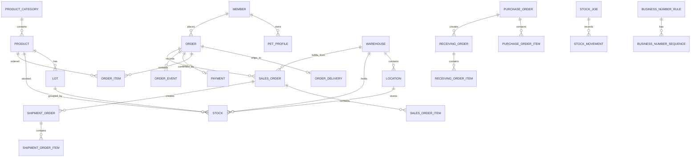

# ERD

## 설계 기준

- DB 레벨 FK 제약은 걸지 않습니다.
- `*_id` 컬럼과 인덱스로 논리 관계를 표현합니다.
- 관계 검증은 서비스 로직과 테스트에서 처리합니다.
- 주요 업무 테이블에는 `created_at`, `created_by`, `updated_at`, `updated_by`, `deleted_at`을 공통 audit 컬럼으로 둡니다.
- `orders`는 고객 주문입니다.
- 판매 주문, 출고 지시, 구매 발주, 입고 지시는 별도 테이블로 분리합니다.
- 현재고는 `창고 -> location -> 상품/LOT` 단위로 관리합니다.
- 현재고 수량은 `total_quantity = available_quantity + working_quantity` 기준입니다.
- 재고 증감/이동 이력은 `stock_jobs`와 `stock_movements` 원장 구조로 관리합니다.

## 핵심 관계



## 핵심 테이블 요약

### 회원/상품

```text
members: id, email, password_hash, name, role, status, audit columns
pet_profiles: id, member_id, name, species, birth_date, allergy_notes, audit columns
product_categories: id, name, display_order, status, audit columns
products: id, category_id, name, description, price, sale_status, audit columns
```

### LOT/재고

```text
lots: id, lot_key, product_id, lot1~lot5, status, audit columns
warehouses: id, code, name, status, audit columns
locations: id, warehouse_id, code, name, location_type, status, audit columns
stocks: id, product_id, warehouse_id, location_id, lot_id, total_quantity, available_quantity, working_quantity, version, audit columns
```

현재고 unique 기준:

```text
product_id + warehouse_id + location_id + lot_id
```

수량 제약:

```text
total_quantity = available_quantity + working_quantity
available_quantity >= 0
working_quantity >= 0
total_quantity >= 0
```

### 고객 주문

```text
customer_orders: id, member_id, order_no, order_type, status, total_amount, discount_amount, payment_amount, ordered_at, confirmed_at, audit columns
customer_order_deliveries: id, customer_order_id, recipient_name, recipient_phone, zip_code, address1, address2, delivery_message, entrance_password, status, audit columns
customer_order_items: id, customer_order_id, status, product_id, quantity, unit_price, line_amount, audit columns
payments: id, customer_order_id, payment_key, status, amount, approved_at, audit columns
customer_order_events: id, customer_order_id, event_type, description, audit columns
```

### 판매/출고/구매/입고

```text
sales_orders: id, sales_order_no, customer_order_id, warehouse_id, order_date, status, confirmed_at, canceled_at, reason, audit columns
sales_order_items: id, sales_order_id, customer_order_item_id, product_id, order_quantity, unit_price, line_amount, status, audit columns
shipment_orders: id, shipment_order_no, sales_order_id, warehouse_id, status, scheduled_ship_date, shipped_at, canceled_at, reason, audit columns
shipment_order_items: id, shipment_order_id, sales_order_item_id, product_id, order_quantity, allocated_quantity, picked_quantity, shipped_quantity, status, audit columns
purchase_orders: id, purchase_order_no, supplier_name, status, ordered_at, confirmed_at, canceled_at, reason, audit columns
purchase_order_items: id, purchase_order_id, product_id, order_quantity, unit_price, line_amount, status, audit columns
receiving_orders: id, receiving_order_no, purchase_order_id, warehouse_id, status, scheduled_receive_date, received_at, canceled_at, reason, audit columns
receiving_order_items: id, receiving_order_id, purchase_order_item_id, product_id, lot_id, order_quantity, received_quantity, lot1~lot5, status, audit columns
```

### 재고 원장

```text
stock_jobs: id, job_no, job_type, warehouse_id, reference_type, reference_id, status, reason, completed_at, audit columns
stock_movements: id, job_id, job_no, stock_id, movement_type, warehouse_id, product_id, lot_id, from_location_id, to_location_id, quantity, total_quantity, reason, audit columns
```

`stock_jobs.reference_type/reference_id`는 재고 작업을 발생시킨 외부 업무가 있을 때 사용합니다.

```text
출고 작업: reference_type = SHIPMENT_ORDER, reference_id = shipment_orders.id
입고 작업: reference_type = RECEIVING_ORDER, reference_id = receiving_orders.id
직접 입고/수동 조정/일반 이동: reference_type = null, reference_id = null
```

`stock_movements.quantity`는 이번 movement의 처리 수량입니다.
`stock_movements.total_quantity`는 movement 처리 후 해당 stock row의 총수량 snapshot입니다.

## LOT 컬럼 의미

| 컬럼 | 의미 |
|---|---|
| lot_key | 사용자가 확인할 수 있는 LOT 업무 번호 |
| lot1 | LOT 주요 식별값 |
| lot2 | 보조 LOT 정보 |
| lot3 | 유효기간 |
| lot4 | 입고일자 |
| lot5 | 기타 관리값 |

## 업무 흐름

출고 흐름:

```text
customer_orders
-> sales_orders
-> shipment_orders
-> stock_jobs(reference_type = SHIPMENT_ORDER)
-> stock_movements
```

입고 흐름:

```text
purchase_orders
-> receiving_orders
-> stock_jobs(reference_type = RECEIVING_ORDER)
-> stock_movements
```

재고 처리 흐름:

```text
입고: RECEIVE_IN, stocks 증가
할당: ALLOCATE, NORMAL location working_quantity 증가
PICK: PICK_OUT/PICK_IN, NORMAL -> PICKTO 이동
출고: SHIP_OUT, PICKTO 재고 차감
```

## 주요 인덱스 후보

| 테이블 | 인덱스 | 목적 |
|---|---|---|
| members | email | 로그인 |
| pet_profiles | member_id | 회원별 반려동물 조회 |
| products | category_id, sale_status | 상품 목록 필터 |
| lots | product_id, lot3, lot4 | 상품/유효기간/입고일자 조회 |
| locations | warehouse_id | 창고별 location 조회 |
| stocks | product_id, warehouse_id, location_id, lot_id | 현재고 조회 |
| customer_orders | member_id, ordered_at | 회원 주문 내역 |
| customer_order_deliveries | customer_order_id | 주문 배송 정보 조회 |
| customer_order_items | customer_order_id | 주문별 상품 조회 |
| stock_jobs | reference_type, reference_id | 출고/입고 지시별 재고 작업 추적 |
| stock_movements | job_id, stock_id, created_at | 작업별/현재고별 원장 조회 |
| sales_orders | customer_order_id | 고객 주문 기준 판매 주문 조회 |
| sales_orders | warehouse_id | 창고별 판매 주문 조회 |
| shipment_orders | sales_order_id, warehouse_id, status | 출고 지시 조회 |
| purchase_orders | status, ordered_at | 구매 발주 조회 |
| receiving_orders | purchase_order_id, warehouse_id, status | 입고 지시 조회 |

## 동시성 검토 대상

- 주문 생성 시 중복 주문번호 방지
- 재고 할당 시 가용수량 동시 차감
- PICKTO 이동 시 출발/도착 현재고 동시 수정
- 출고 확정 시 PICKTO 작업수량 동시 차감
- 업무 번호 구간 할당 중복 방지